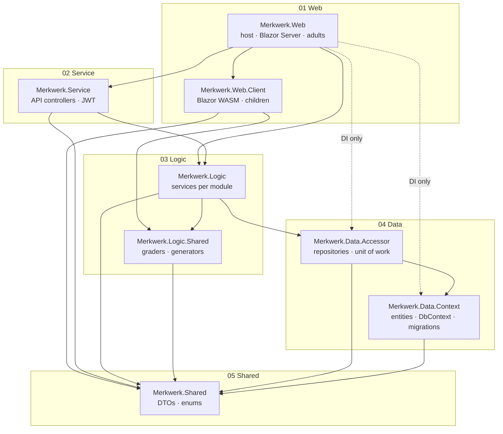

# Project structure and infrastructure – Merkwerk

Where things live and how the parts fit together. For the rules behind the structure see
[AGENTS.md](../AGENTS.md); for the reasoning see the ADRs in [docs/adr](adr/).

## 1. Repository layout

```
Merkwerk/
├─ sources/                          all .NET code
│  ├─ Merkwerk.slnx                  solution (solution folders 01–06)
│  ├─ Directory.Packages.props       central NuGet versions
│  ├─ Directory.Build.props          shared build settings (nullable, warnings, LangVersion)
│  ├─ Merkwerk.Web/                  01 Web
│  ├─ Merkwerk.Web.Client/           01 Web
│  ├─ Merkwerk.Service/              02 Service
│  ├─ Merkwerk.Logic/                03 Logic
│  ├─ Merkwerk.Logic.Shared/         03 Logic
│  ├─ Merkwerk.Data.Context/         04 Data
│  ├─ Merkwerk.Data.Accessor/        04 Data
│  ├─ Merkwerk.Shared/               05 Shared
│  └─ Merkwerk.*.Tests/              06 Tests
├─ shared/
│  ├─ grading-cases/<type>/*.json    test cases for graders (used by Logic.Shared.Tests)
│  └─ design-tokens/tokens.json      colours, fonts, spacing – single source for all UIs
├─ deploy/
│  ├─ docker-compose.yml             proxy (Caddy), app, db (MySQL)
│  ├─ Caddyfile
│  └─ .env.example                   template for deploy/.env (never commit .env)
├─ docs/
│  ├─ adr/                           architecture decision records 001–NNN
│  ├─ git.README.md                  Git workflow
│  ├─ infrastructure.README.md       this file
│  └─ self-hosting.md                (planned) running Merkwerk at home or in a school
├─ .claude/skills/                   AI workflows (implement-ticket, add-entity, …)
├─ .github/workflows/                CI (build, test, multi-arch images)
├─ AGENTS.md  CLAUDE.md  README.md  LICENSE  .gitignore  .gitattributes
```

Physical folders under `sources/` are flat (one folder per project, no spaces). The numbers `01 Web` … `06 Tests`
exist only as solution folders in `Merkwerk.slnx`.

## 2. Projects and dependencies



`Merkwerk.Web.Client` must never reach `Logic` or any `Data.*` project, and `Merkwerk.Logic` reaches the database only through
`Merkwerk.Data.Accessor` – never `MerkwerkDbContext` or `DbSet<T>` directly. `Merkwerk.Architecture.Tests` fails the build otherwise.

## 3. Inside each project

### Merkwerk.Web (host, adults – Interactive Server)

```
Merkwerk.Web/
├─ Program.cs                  composition root: DI, auth, render modes, endpoints
├─ Components/
│  ├─ App.razor, Routes.razor
│  ├─ Layout/                  admin layout, navigation
│  └─ Pages/Admin/<Module>/    /admin/... pages (exercises, assignments, progress, learners)
├─ ViewModels/<Module>/        MVVM view models for pages with logic
├─ Mvvm/                       MvvmComponentBase<TViewModel>
├─ Resources/                  German UI strings (.resx)
└─ wwwroot/                    static files, generated tokens CSS
```

### Merkwerk.Web.Client (children – Interactive WebAssembly, PWA)

```
Merkwerk.Web.Client/
├─ Pages/Ueben/                /ueben/... (profile selection, my tasks, player, flashcards)
├─ Practice/
│  ├─ Questions/               one component per question type (<Type>Question.razor)
│  ├─ Aids/                    learning aids (CountingDots, TimesTableMatrix, Keypad)
│  └─ Feedback/                feedback, stars, loading screen
├─ ViewModels/                 PlayerViewModel, MyTasksViewModel, …
├─ Services/
│  ├─ Api/                     typed API client (HttpClient + DTOs from Shared)
│  ├─ Speech/                  read-aloud (Web Speech API via JS interop)
│  └─ DragDrop/                SortableJS wrapper
├─ Resources/                  German UI strings
└─ wwwroot/                    manifest.webmanifest, service-worker.js, icons, js/
```

### Merkwerk.Service (API)

```
Merkwerk.Service/
├─ Controllers/V1/             DevicesController, SessionsController, AssignmentsController, AttemptsController, …
├─ Auth/                       JWT issuing/validation, cookie transport, refresh-token rotation, policies
├─ OpenApi/                    OpenAPI configuration
└─ ServiceCollectionExtensions.cs   AddMerkwerkApi(), MapMerkwerkApi()
```

### Merkwerk.Logic (business logic)

```
Merkwerk.Logic/
├─ Organizations/   Learners/   Exercises/   Assignments/
├─ Practice/        Progress/   WordLists/   (later: Sharing/, Administration/)
│     each: I<Module>Service.cs, <Module>Service.cs, Validators/, internal types
├─ Common/                     ICurrentUser, authorization helpers, result types
└─ ServiceCollectionExtensions.cs
```

### Merkwerk.Logic.Shared (also runs in the browser)

```
Merkwerk.Logic.Shared/
├─ Grading/                    IGrader, GraderRegistry, <Type>Grader
├─ Generators/                 IExerciseGenerator, ArithmeticGenerator, TimesTableGenerator
├─ Learning/                   Leitner rules (box transitions, due dates)
└─ Text/                       tolerance rules, syllable helpers
```

No EF Core, no ASP.NET Core, no I/O, no `DateTime.Now`, no `Random.Shared`.

### Merkwerk.Data.Context (EF model and database)

```
Merkwerk.Data.Context/
├─ Entities/                   AEntityBase, AOrganizationEntityBase, all entities
├─ Configurations/             IEntityTypeConfiguration<T> per entity
├─ Interceptors/               AuditSaveChangesInterceptor
├─ Converters/                 UTC DateTime, JSON value converters
├─ Migrations/                 EF Core migrations (generated) – migration target: -p Merkwerk.Data.Context
├─ MerkwerkDbContext.cs        incl. global query filter per organization
├─ DesignTimeDbContextFactory.cs   for `dotnet ef` without starting the web host (optional)
└─ ServiceCollectionExtensions.cs  AddMerkwerkDbContext()  – registers IDbContextFactory<MerkwerkDbContext>
```

Packages: `MySql.EntityFrameworkCore`, `Microsoft.EntityFrameworkCore.Design` (private assets).

### Merkwerk.Data.Accessor (repositories and unit of work)

```
Merkwerk.Data.Accessor/
├─ Repositories/               IRepository<T>, Repository<T>, specialised repositories (IExerciseRepository, …)
├─ UnitOfWork/                 IUnitOfWork, UnitOfWork, IUnitOfWorkFactory, UnitOfWorkFactory
└─ ServiceCollectionExtensions.cs  AddMerkwerkDataAccess()
```

The unit of work creates its own `MerkwerkDbContext` from `IDbContextFactory` and disposes it at the end of the
business operation. This is the only project (besides `Merkwerk.Data.Context` itself) that touches `MerkwerkDbContext`.

### Merkwerk.Shared (contracts)

```
Merkwerk.Shared/
├─ Api/<Module>/               request/response DTOs (records)
├─ QuestionTypes/              payload/solution types with JSON discriminators
├─ Enums/
└─ Constants/                  policy names, route prefixes, limits
```

### Tests (06 Tests)

| Project | Covers | Tools |
| --- | --- | --- |
| Merkwerk.Logic.Shared.Tests | graders against `shared/grading-cases`, generators (determinism) | xUnit |
| Merkwerk.Logic.Tests | services incl. permissions, mocked `IUnitOfWork` | xUnit, NSubstitute |
| Merkwerk.Web.Tests | view models; Razor components | xUnit, bUnit |
| Merkwerk.Data.IntegrationTests | repositories, unit of work, audit interceptor, query filters, migrations | xUnit, Testcontainers (MySQL) |
| Merkwerk.Service.IntegrationTests | controllers, auth, end-to-end API behaviour | WebApplicationFactory, Testcontainers (MySQL) |
| Merkwerk.Architecture.Tests | dependency rules | NetArchTest |

## 4. Runtime infrastructure

```
 Laptop (adults)          Tablet (children)
      │ HTTPS + SignalR        │ HTTPS, REST/JSON
      └──────────┬─────────────┘
           ┌─────▼─────┐   :443
           │  proxy    │   Caddy, TLS (tls internal on the home network)
           └─────┬─────┘
           ┌─────▼─────┐   :8080 (internal)
           │   app     │   .NET 10: Blazor Server + WASM files + /api/v1
           └─────┬─────┘
           ┌─────▼─────┐   :3306 (internal only)
           │    db     │   MySQL 8.4, volume db-data
           └───────────┘
                 │ nightly mysqldump → NAS / USB drive
```

| Container | Image | Exposed | Volumes |
| --- | --- | --- | --- |
| `proxy` | `caddy:2` | 443 | `caddy-data` (certificates) |
| `app` | `ghcr.io/<owner>/merkwerk:<version>` | internal only | `media` (uploaded images/audio) |
| `db` | `mysql:8.4` | internal only | `db-data` |

Environments:

| | Local development | Raspberry Pi (family) |
| --- | --- | --- |
| App | `dotnet run` / `dotnet watch` | container from registry |
| Database | `db` container from `deploy/docker-compose.yml` | same compose file |
| TLS | `dotnet dev-certs https` | Caddy `tls internal`, root cert installed on tablets |
| Images | built locally | multi-arch (amd64 + arm64) from CI on tag `v*` |
| Hardware | – | Pi 4/5, ≥ 4 GB RAM, boots from SSD |

## 5. Configuration

Precedence (last wins): `appsettings.json` → `appsettings.{Environment}.json` → user secrets (development) → environment variables.

| Setting | Key / variable | Where it is set |
| --- | --- | --- |
| Database connection | `ConnectionStrings__Default` | user secrets locally, `deploy/.env` on the Pi |
| JWT signing key | `Auth__Jwt__SigningKey` | user secrets / `.env` – never in appsettings |
| Access/refresh lifetimes | `Auth__Jwt__AccessTokenMinutes`, `Auth__RefreshTokenDays` | appsettings |
| Media storage path | `Media__Path` | appsettings / `.env` |
| Registration open | `Instance__AllowRegistration` | appsettings / admin page (phase 2) |

```powershell
# local secrets (once per machine)
cd sources/Merkwerk.Web
dotnet user-secrets init
dotnet user-secrets set "ConnectionStrings:Default" "Server=localhost;Database=merkwerk;User=app;Password=..."
dotnet user-secrets set "Auth:Jwt:SigningKey" "<at least 32 random characters>"
```

## 6. CI/CD (GitHub Actions)

| Trigger | Steps |
| --- | --- |
| Push / PR to `Development` | restore → build (warnings as errors) → unit tests → integration tests (Testcontainers) → architecture test |
| Tag `v*` | everything above → build EF migration bundle → `docker buildx` amd64 + arm64 → push to GitHub Container Registry |

## 7. Naming conventions at a glance

| Thing | Pattern | Example |
| --- | --- | --- |
| Project | `Merkwerk.<Layer>[.<Part>]` | `Merkwerk.Logic.Shared` |
| Namespace | project + folder | `Merkwerk.Logic.Exercises` |
| Service | `I<Module>Service` / `<Module>Service` | `IAssignmentService` |
| Entity | singular noun | `WordEntry` |
| DTO | `<Thing>Dto`, `<Action>Request`, `<Action>Response` | `StartAttemptRequest` |
| View model | `<Page>ViewModel` | `PlayerViewModel` |
| Razor component | PascalCase, purpose first | `ClozeQuestion.razor` |
| Migration | PascalCase, what changes | `AddWordLists` |
| Grading cases | `shared/grading-cases/<type-kebab>/<case>.json` | `cloze/typo-tolerance.json` |
