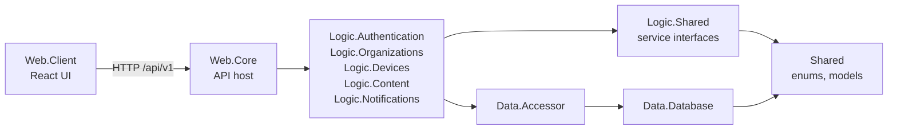

# Project structure and infrastructure

This guide describes the repository as it exists today. Product modules and deployment features still marked as planned
in tickets are not implied to be implemented. Architecture and dependency rules are authoritative in
[AGENTS.md](../AGENTS.md); architectural rationale is in the [ADR index](adr/README.md).

## Repository layout

```text
Merkwerk/
├─ sources/
│  ├─ Merkwerk.slnx
│  ├─ Web.Client/                 React/TypeScript single-page application
│  ├─ Web.Core/                   ASP.NET Core API host: Bundles/ (registration, pipeline, startup migration), controllers
│  ├─ Logic.Authentication/       sign-in, token, and session services
│  ├─ Logic.Notifications/        mail templates and SMTP service
│  ├─ Logic.Organizations/        setup, families, invitations, child profiles
│  ├─ Logic.Devices/              device pairing and children's sessions
│  ├─ Logic.Content/              subjects, later exercises, check rules and generators
│  ├─ Logic.Shared/               service interfaces (Interfaces/); pure exercise logic is planned
│  ├─ Shared/                     enums and service models, no references
│  ├─ Data.Database/              EF Core model, configuration, and migrations
│  ├─ Data.Accessor/              repositories and unit-of-work implementation
│  ├─ Architecture.Tests/
│  ├─ Data.IntegrationTests/
│  └─ Logic.*.Tests/              unit tests per logic project
├─ shared/
│  ├─ grading-cases/              JSON fixtures (currently free-text examples)
│  └─ design-tokens/              design reference values
├─ deploy/                        Docker Compose, Dockerfile, Caddy, local setup script
├─ docs/                          ADRs and contributor documentation
└─ .github/workflows/             CI and tagged-image release workflows
```

`01 Web` through `05 Tests` are logical folders in `Merkwerk.slnx`, not physical directories. The source tree is flat.

## Project responsibilities



- **Web.Client** is a standalone TypeScript application. It does not reference .NET projects; it communicates with
  `Web.Core` over the REST API.
- **Web.Core** is the ASP.NET Core host. Controllers and HTTP concerns (cookies, status codes, authorization, and
  OpenAPI) belong here; `Bundles/` holds service registration, the request pipeline and the startup migration.
- **Logic.Authentication** contains authentication/session business logic. **Logic.Notifications** contains mail
  abstractions, templates, and SMTP delivery. **Logic.Organizations** holds setup, memberships, invitations and child
  profiles (LP-105); **Logic.Devices** holds device pairing and children's sessions (LP-106); **Logic.Content** holds
  subjects (LP-109) and later exercises.
- **Data.Accessor** is the application-facing repository/unit-of-work layer. **Data.Database** contains EF Core entities,
  configuration, interceptors, and migrations.
- **Logic.Shared** holds the service interfaces (`Logic.Shared.Interfaces`) and later the pure graders and generators.
  **Shared** holds enums (`Shared.Enums`) and service models (`Shared.Models`) and references nothing. The full
  dependency table is in [AGENTS.md](../AGENTS.md) §3 and enforced by `Architecture.Tests`.
- **Architecture.Tests** enforces dependency boundaries. `Data.IntegrationTests` exercises database behavior against
  MySQL through Testcontainers.

The API has endpoints for authentication, setup, invitations, members, learners and devices; confirm endpoint
availability in `Web.Core/Services/ApiControllers` before relying on one.

## Local development

Requirements: .NET 10 SDK, Node.js LTS with npm, and Docker Desktop for local MySQL, Mailpit, and integration tests.

From the repository root, the setup script creates `deploy/.env` if needed, starts MySQL and Mailpit, and stores the
database connection string and JWT signing key as `Web.Core` user secrets:

```powershell
.\deploy\setup-local.ps1
```

Then run the API – it applies pending migrations itself when it starts (ADR 016), also after you pull new ones. On a fresh database the web client opens the first-run setup (`/setup`), which creates your
account and family (LP-105):

```powershell
cd sources
dotnet run --project Web.Core --launch-profile http
```

The HTTP profile listens at `http://localhost:5138`; Swagger is at `/swagger`. Run the client in another terminal:

```powershell
cd sources\Web.Client
npm ci
npm run dev
```

Vite listens at `http://localhost:65350` and proxies `/api` to `http://localhost:5138`. Development uses plain HTTP.

To try the children's area (LP-106): add a child under **Familie**, create a pairing code under **Geräte**
(`/admin/devices`) and enter it at `/practice/pair` – on a phone in the LAN, or in a second browser profile (the device
cookie `mw_device` and the auth cookies are per browser profile). Pairing allows 5 attempts per minute and client
address; more answer `429`.
For the local TLS reverse proxy and LAN-device workflow, see the comments in `deploy/docker-compose.yml` and
`deploy/Caddyfile.dev`.

To start only the local database and mail catcher manually:

```powershell
docker compose -f deploy/docker-compose.yml --profile dev up -d db mailpit
```

Mailpit's UI is `http://localhost:8025` and its SMTP endpoint is `localhost:1025`. All development mail is captured
locally.

### Build and test

```powershell
cd sources
dotnet build Merkwerk.slnx -c Release
dotnet test Merkwerk.slnx -c Release

cd Web.Client
npm ci
npm run lint
npm run format:check
npm run build
```

Database integration tests and local database services require Docker. The app applies pending migrations at startup
in every environment (ADR 016); existing data stays. Restore the pinned EF tool once with `dotnet tool restore`, then
generate a migration from `sources` as needed:

```powershell
dotnet ef migrations add <Name> -p Data.Database -s Web.Core
dotnet ef database update -p Data.Database -s Web.Core   # optional – applies it without starting the app
```

### Migration reset (LP-164)

Before the first release all migrations were squashed into a single new `InitializeDatabase` migration. A local
database created with the old migrations no longer matches the migration history and must be recreated once (all local
data is lost):

```powershell
cd sources
dotnet ef database drop -p Data.Database -s Web.Core --force
dotnet run --project Web.Core --launch-profile http   # creates the schema at startup
```

The web client then opens the first-run setup again.

## Deployment

`deploy/docker-compose.yml` defines:

| Service | Purpose | Ports |
| --- | --- | --- |
| `proxy` | Caddy reverse proxy with an internal TLS certificate | 80, 443 |
| `app` | ASP.NET Core runtime image | Internal port 8080 |
| `migrate` | Optional one-shot EF migration bundle (Compose profile `migrate`); the app also migrates at startup | None |
| `db` | MySQL 8.4 with `utf8mb4` and `utf8mb4_0900_ai_ci` | 127.0.0.1:3306 |
| `mailpit` | Development-only SMTP catcher (profile `dev`) | 127.0.0.1:1025, 127.0.0.1:8025 |
| `proxy-dev` | Development HTTPS proxy for LAN testing (profile `dev`) | 8443 |

Copy `deploy/.env.example` to `deploy/.env` and configure values for a self-hosted deployment. Never commit `.env`.
The production Caddy configuration uses its internal CA; install the generated root certificate on trusted client
devices. Back up the MySQL data volume and any other persistent data before upgrades.

The release workflow builds amd64 and arm64 application and migration images when a `v*` tag is pushed. CI separately
builds/tests the .NET solution and lints/builds the UI on its configured branch and pull-request events. See
[`.github/workflows/ci.yml`](../.github/workflows/ci.yml) and
[`.github/workflows/release.yml`](../.github/workflows/release.yml).

The current `deploy/Dockerfile` publishes `Web.Core` only; it does not bundle the React `Web.Client` build into the
runtime image. The Compose stack and image workflow are deployment groundwork, not yet a complete self-hosted delivery
of the browser UI.

## Configuration and secrets

Local development uses `Web.Core` user secrets. Production values are supplied by Compose environment variables from
`deploy/.env`.

| Setting | Purpose |
| --- | --- |
| `ConnectionStrings__Default` | MySQL connection |
| `Auth__Jwt__SigningKey` | JWT signing secret; never store it in source control |
| `Mail__Host`, `Mail__Port`, `Mail__Security` | SMTP transport configuration |
| `Mail__UserName`, `Mail__Password` | SMTP credentials |
| `Mail__FromAddress` | Sender address |
| `App__PublicBaseUrl` | Base URL used to build public mail links |
| `Media__Path` | Persistent media path configured for the app |
| `DataProtection__KeysPath` | Persistent key ring for password-reset and confirmation links (`/data/keys` volume) |

For local development, inspect or set secrets without putting values in project files:

```powershell
dotnet user-secrets list --project sources\Web.Core
dotnet user-secrets set "Auth:Jwt:SigningKey" "<development-only random key>" --project sources\Web.Core
```

Do not commit credentials, signing keys, certificates, private child data, or production configuration.
